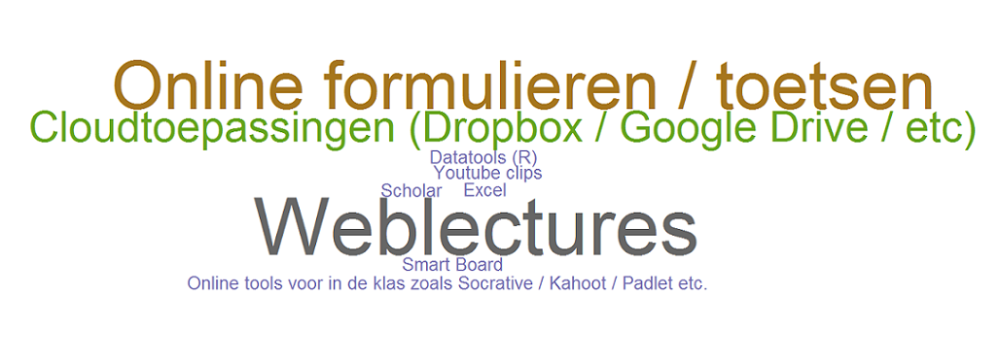
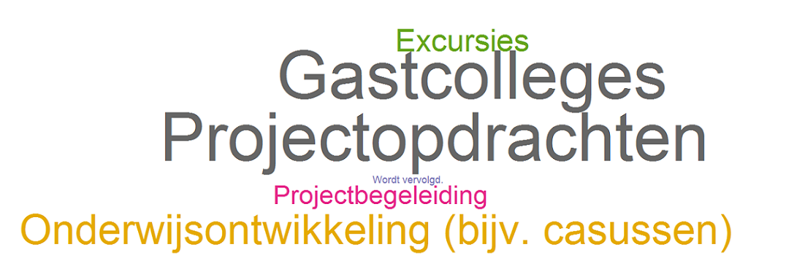

## Welkom! 

---

## Hoe waarderen onze collegae ons?

<iframe src='Docenten.html'></iframe>

---

## Hoe waarderen onze studenten ons?

<iframe src='Studenten.html'></iframe>

---

## Technologie

---

## Beroepenveld

